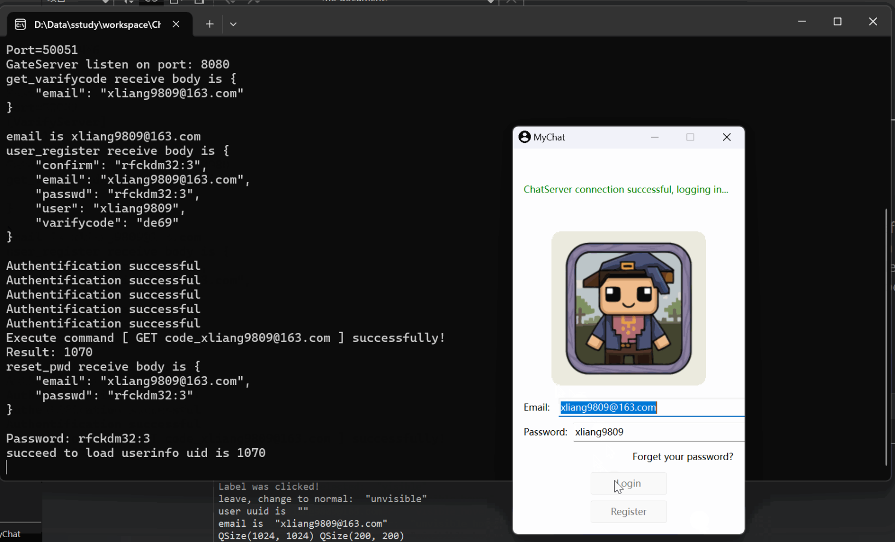
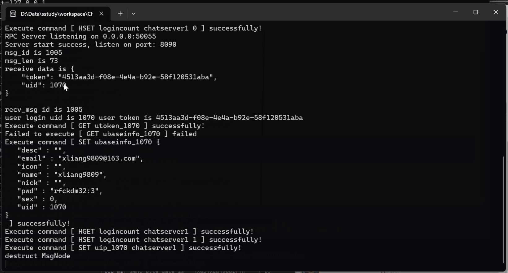

# ChatRoom
Instant messaging project in Linux
From llfc
## 开发背景
1. 提供高效实时的沟通平台
2. 为管理用户账号实现注册/登录/修改密码功能
3. 为传递信息/实时通讯实现聊天功能

## 环境依赖项
```bash
# boost
sudo apt-get install libboost-dev libboost-test-dev libboost-all-dev

# jsoncpp
sudo apt install libjsoncpp-dev

# hiredis
sudo apt-get install libhiredis-dev

# mysql
sudo apt install libmysqlcppconn-dev

# protobuf & grpc 参考以下三个链接
# https://blog.csdn.net/weixin_36378508/article/details/130600632
# https://developer.aliyun.com/article/819208
# https://gitbookcpp.llfc.club/sections/cpp/distribute/asio27.html
# 注意事项:
# 1. 下载grpc包, 先在third_party/protobuf里面编译protobuf, 否则grpc和protobuf可能不兼容
# 2. 必须先编译protobuf后编译grpc
```

## 项目部署
工程目录下根据CMakeLists.txt编译项目

```bash
mkdir build
pushd build
cmake ..
make -j 4
popd
```

安装mysql-server后, 初始化数据库
```sql
-- 初始化并选中数据库
CREATE DATABASE mychat;
USE mychat;
-- 执行sql文件创建user, user_id, friend, friend_apply表
SOURCE /home/tom/workspace/ChatRoom//src/ChatRoom.sql
```

## 客户端界面展示
### 登录

### 聊天


## 分布式服务端(各服务使用gRPC通讯)
### GateServer - 网关服务
用于建立与客户端的http短连接, 主要面向注册, 修改密码, 登录等功能

### VarifyServer - 验证服务
生成并发送验证码, 用于增加账号的注册和修改密码逻辑的安全性

### StatusServer - 状态服务
实现负载均衡, 查询缓存中负载更低的聊天服务信息`ip + port + token`用于客户端建立tcp长连接

### ChatServer - 通讯服务
#### ChatServer1/ChatServer2
用于建立与客户端的tcp长连接(每个会话生命周期由CSession管理), 主要面向好友申请, 好友认证, 消息转发等功能




## 编译gRPC注意事项
### 1. 下载grpc源码包
```bash
# 获取源码包
git clone https://github.com/grpc/grpc.git
cd grpc
# 更新grpc依赖的第三方库
git submodule update --init
```

### 2. 编译并安装grpc包中的protobuf
```bash
cd third_party/protobuf
# 更新protobuf依赖的第三方库
git submodule update --init --recursive
# bazel编译protobuf
sudo apt-get install g++ git bazel
bazel build :protoc :protobuf --enable_bzlmod
# 拷贝到工作目录中去
cp bazel-bin/protoc /usr/local/bin

mkdir -p cmake/build
pushd cmake/build
cmake ../..
make -j 4
sudo make install
popd
```

### 3. 编译并安装grpc
```bash
cd grpc
# 编译并安装
mkdir -p cmake/build
pushd cmake/build
# 安装abseil | -DABSL_ENABLE_INSTALL=TRUE 安装abseil
# 安装gRPC | -DgRPC_INSTALL=ON
# CMakeLists.txt所在目录 | ../..
cmake -DgRPC_INSTALL=ON -DABSL_ENABLE_INSTALL=TRUE ../..
make -j 4
# 安装默认位置是/usr/local
sudo make install
popd
```

### 4. 验证gRPC已成功安装
```bash
cd grpc/examples/cpp/helloworld
mkdir build
cd build
# 编译
cmake ..
make -j 4
# 编译完成后，分别执行greeter_server和greeter_client进行测试
```

## 编写CMakeLists.txt注意事项
- gRPC例程通过了说明gRPC和protobuf是没问题的
- 后续需要通过make报错日志修改CMakeLists.txt
- 最终加入utf8_range库成功编译了一次

```bash
find_package(utf8_range REQUIRED)

target_link_libraries(
    GateServer 
    PRIVATE
    utf8_range::utf8_range
    utf8_range::utf8_validity
)

# cmake .. 出现以下内容不影响项目的编译
#CMake Warning at /usr/share/cmake-3.22/Modules/FindProtobuf.cmake:524 (message):
#  Protobuf compiler version 29.0 doesn't match library version 5.29.0
#Call Stack (most recent call first):
#  CMakeLists.txt:13 (find_package)
```
